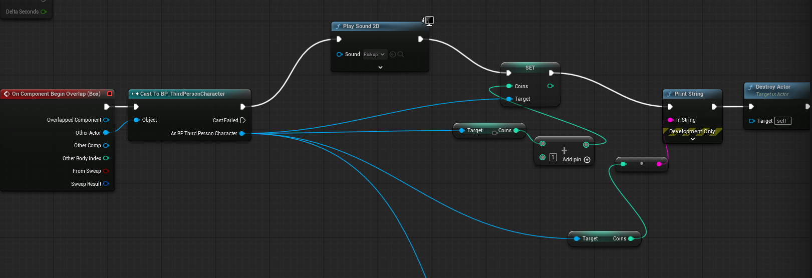
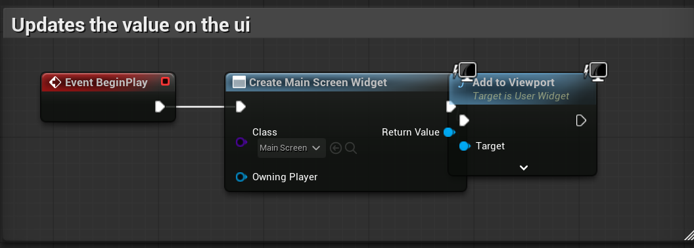
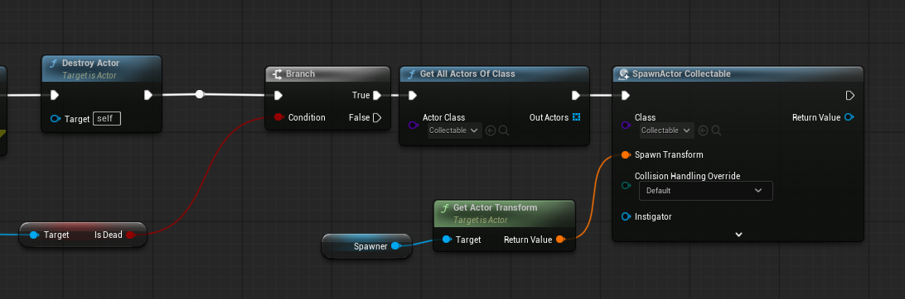

Task:

Here you can observe the rotating coins I created for my game, you can pick them up and the count for how many coins you have increases on the screen UI. When collecting coins the coins have a pick-up sound.

Here you can see in the collectable's blueprint how it increases the ThirdPersonCharacter's variable of coins, as well as triggering the sound effect. As well its rotating element and it's cylinder static mesh that creates the coin.

Here's the UI changing and updating on BeginPlay:

One of my issues is that when I run the game, the pickup sound effect for the coin plays extremely loudly once before working perfectly fine with the collecting. As well I seemingly can't figure out how to reset the coins upon death. I want them to spawn back in once you fall off the map here's what I have so far:

It's the second half of the first photo where the coins vairable increases upon being collided. 